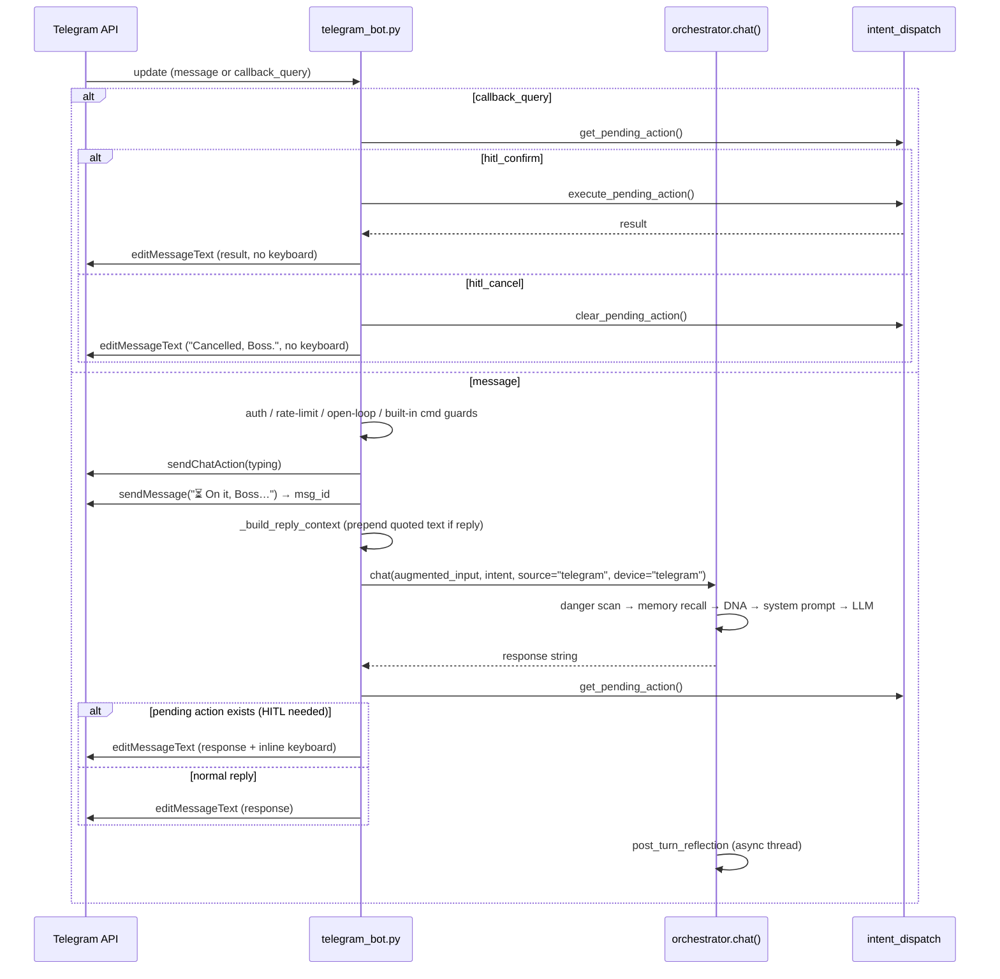

# Design Document: Telegram Chat Parity

## Overview

This design closes the gap between EDITH's Telegram bot and its web chat UI by routing every Telegram text message through `orchestrator.chat()` instead of directly through `intent_dispatch.dispatch()`. The change is almost entirely in `telegram_bot.py` — the orchestrator already supports `source="telegram"` and already maintains `_source_history["telegram"]` isolated from other channels.

On top of the pipeline change, the design adds: a typing indicator, three utility commands (`/history`, `/clear`, `/status`), photo/vision support, reply-thread context injection, inline HITL keyboard buttons, and consistent EDITH-flavoured error messages — while preserving every existing command and behaviour.

**No changes to `orchestrator.py` are required.** The infrastructure (per-source history, Telegram JSONL persistence, DNA, emotion/urgency, CHANNEL_PERSONAS, skill injection, post-turn reflection) is already fully implemented and activated whenever `source="telegram"` is passed to `chat()`.

---

## Architecture

### Current Flow

```
poll_telegram() / handle_telegram_update()
  └─ process_message(text)
       ├─ detect_intent(text)
       └─ dispatch(DispatchContext(...))   ← bypasses pipeline
```

Shortcut path through `dispatch()` skips: memory recall, DNA modifiers, EDITH persona, emotion detection, post-turn reflection, skill injection, and per-source history isolation.

### Target Flow

```
poll_telegram() / handle_telegram_update()
  ├─ [guard] security / rate limit / open-loop shortcuts / built-in commands
  ├─ send typing indicator (sendChatAction)
  ├─ send placeholder "⏳ On it, Boss..."
  └─ process_message(text)
       ├─ detect_intent(text)             ← still run for intent param
       ├─ [reply-thread] prepend quoted context if reply_to_message present
       └─ orchestrator.chat(             ← full pipeline
              user_input=augmented_text,
              intent=detected_intent,
              source="telegram",
              device="telegram"
         )
```

`orchestrator.chat()` internally handles the full pipeline:
1. Danger scan
2. Memory recall (SmartMemory + ChromaDB + graph triples + episodic episodes)
3. Conversation DNA (`device="telegram"` → `max_length=300`)
4. System prompt assembly (persona + `user.md` + `memory.md` + project state + `CHANNEL_PERSONAS["telegram"]`)
5. Skill injection
6. LLM call (with optional council routing)
7. Response verification
8. History append to `_source_history["telegram"]` + `data/telegram_memory.jsonl`
9. Post-turn reflection (fire-and-forget thread)
10. Episode save

### Callback Query Flow (HITL)

```
poll_telegram()
  ├─ update.get("callback_query") branch
  │    ├─ hitl_confirm → execute_pending_action() → edit message with result
  │    └─ hitl_cancel  → clear_pending_action()   → edit message "Cancelled, Boss."
  └─ update.get("message") branch  (unchanged routing above)
```

---

## Components and Interfaces

### `telegram_bot.py` — changes

| Function | Change |
|---|---|
| `process_message(text)` | Replace `dispatch(ctx)` call with `orchestrator.chat(augmented_text, intent=intent, source="telegram", device="telegram")`. Keep open-loop shortcut guards before routing. |
| `poll_telegram()` | Add typing indicator call. Add `/history`, `/clear`, `/status` command dispatch. Add photo message branch. Add `callback_query` branch for HITL. Wrap processing in EDITH-flavoured exception handler. |
| `handle_telegram_update()` | Mirror the same additions as `poll_telegram()` (webhook parity). |
| `_handle_history_cmd()` | New. Reads `orchestrator._source_history["telegram"]` and formats the last 10 turns. |
| `_handle_clear_cmd()` | New. Clears `orchestrator._source_history["telegram"]` and overwrites `data/telegram_memory.jsonl`. |
| `_handle_status_cmd()` | New. Collects provider, history length, memory count, time and returns a ≤300-char status string. |
| `_send_typing()` | New. Wraps `sendChatAction` with `action="typing"`, swallows exceptions. |
| `_build_reply_context(msg)` | New. Extracts `reply_to_message` text, returns augmented `user_input` string. |
| `_send_hitl_keyboard(msg_id, prompt_text)` | New. Edits the placeholder message to add an inline `InlineKeyboardMarkup` with Yes/No buttons. |
| `_handle_callback_query(cq)` | New. Routes `hitl_confirm` / `hitl_cancel` callback queries. |
| `_handle_photo(msg)` | New. Downloads highest-res photo, builds a `DispatchContext` with intent="vision", dispatches to `_handle_vision`. |
| `_edith_error(e, context_hint)` | New. Formats any exception into an EDITH-voiced error string. |

### `orchestrator.py` — no changes required

The orchestrator already:
- Accepts `source="telegram"`, `device="telegram"`
- Uses `_source_history["telegram"]` isolation
- Pre-loads and persists `data/telegram_memory.jsonl`
- Applies `CHANNEL_PERSONAS["telegram"]`
- Calls DNA with `device` parameter
- Runs post-turn reflection and episode save
- Returns `"[EDITH] ..."` prefixed strings on total failure

### `intent_dispatch.py` — no changes required

`set_pending_action()`, `get_pending_action()`, `clear_pending_action()`, and `execute_pending_action()` are already implemented and thread-safe. Since there is only one user (Vaibhav), the global pending action state is sufficient.

---

## Data Models

### Per-message update routing

The update object from Telegram's API can contain either `message` or `callback_query` at the top level. Both `poll_telegram()` and `handle_telegram_update()` must check for both keys:

```python
# poll_telegram inner loop
for update in updates:
    last_update_id = update["update_id"] + 1
    if "callback_query" in update:
        _handle_callback_query(update["callback_query"])
        continue
    msg = update.get("message", {})
    # ... existing message handling path
```

### Photo message structure

Telegram sends photos as a list of `PhotoSize` objects at `msg["photo"]`, sorted by resolution ascending. The highest-resolution version is always `msg["photo"][-1]`. It has these fields:

```python
{
  "file_id": str,       # used to call getFile → get file_path → download
  "file_size": int,
  "width": int,
  "height": int,
}
```

Download URL pattern: `https://api.telegram.org/bot{TOKEN}/getFile?file_id={file_id}` → returns `result.file_path` → download from `https://api.telegram.org/file/bot{TOKEN}/{file_path}`.

### HITL pending action state

No new data structure needed. `intent_dispatch._pending_action` already holds a dict like:

```python
{"type": "shell", "cmd": "rm -rf /tmp/old"}
# or
{"type": "create_file", "path": "/home/vaibhav/notes.txt", "content": "..."}
```

The Telegram bot stores the `message_id` of the placeholder locally in the message-processing scope so it can edit it when the callback query arrives. Since HITL is synchronous from the user's perspective (only one pending action at a time), the `msg_id` for the HITL prompt is stored in a module-level variable `_hitl_msg_id` alongside `_pending_action`.

```python
# In telegram_bot.py (module level)
_hitl_msg_id: int | None = None
```

### Inline keyboard payload

```python
reply_markup = {
    "inline_keyboard": [[
        {"text": "✅ Yes, run it", "callback_data": "hitl_confirm"},
        {"text": "❌ Cancel",       "callback_data": "hitl_cancel"},
    ]]
}
```

This is included in the `editMessageText` call that replaces the "⏳ On it, Boss..." placeholder when a HITL confirmation is needed.

---

## New Command Implementations

### `/history`

```
_handle_history_cmd()
  ├─ from orchestrator import _source_history
  ├─ turns = _source_history["telegram"][-20:]   # last 20 messages = 10 pairs
  ├─ if len(turns) < 2: return "No conversation history yet, Boss."
  └─ format each message:
       user turn    → "👤 <text[:150]>…"
       assistant    → "🤖 <text[:150]>…"
```

Returned string is sent with `send_telegram(result, parse_mode=None)` — no Markdown to avoid formatting collisions in message content.

### `/clear`

```
_handle_clear_cmd()
  ├─ from orchestrator import _source_history, TELEGRAM_JSONL
  ├─ _source_history["telegram"].clear()
  └─ atomic file overwrite:
       tmp = tempfile.NamedTemporaryFile(dir=data_dir, suffix=".jsonl", delete=False)
       tmp.write(b"")
       tmp.close()
       os.replace(tmp.name, TELEGRAM_JSONL)
  ├─ success → "🗑 Telegram history cleared, Boss. Fresh start."
  └─ OSError → "Cleared in memory, Boss. Disk write failed — [e]. Will try again next restart."
```

### `/status`

```
_handle_status_cmd()
  ├─ provider: smart_router.router_status().get("active_provider", "unavailable")
  ├─ history_len: len(_source_history["telegram"])
  ├─ memory_count: smart_memory.count() or "unavailable"
  ├─ time: datetime.now().strftime("%H:%M %Z")
  └─ format (plain text, ≤300 chars):
       "🤖 EDITH Status\n"
       "⚡ Provider: {provider}\n"
       "💬 Telegram turns: {history_len}\n"
       "🧠 Memories: {memory_count}\n"
       "🕐 {time}"
```

Each sub-call is individually wrapped in `try/except` to guarantee partial results on failure.

---

## Typing Indicator

```python
def _send_typing(chat_id: str) -> None:
    url = f"https://api.telegram.org/bot{TOKEN}/sendChatAction"
    try:
        req.post(url, json={"chat_id": chat_id, "action": "typing"}, timeout=5)
    except Exception as e:
        log.warning(f"Typing indicator failed: {e}")
```

Called once per incoming message, before `send_telegram_placeholder()`. Never retried or looped.

---

## Reply-Thread Context Injection

```python
def _build_reply_context(msg: dict, user_input: str) -> str:
    reply_msg = msg.get("reply_to_message", {})
    quoted = reply_msg.get("text", "").strip()
    if not quoted:
        return user_input
    if len(quoted) > 200:
        quoted = quoted[:200]
    return f'[Replying to: "{quoted}"] {user_input}'
```

The augmented string replaces `text` everywhere downstream, including the `orchestrator.chat()` call. The orchestrator treats it as a single user message — no special handling required on that side.

---

## Inline HITL Button Flow

The critical insight is that `handlers/shell.py` calls `intent_dispatch.set_pending_action(action)` and returns a string containing "Type **YES** to run or **NO** to cancel." The Telegram bot needs to intercept this pattern and substitute an inline keyboard.

### Detection

After `orchestrator.chat()` returns, check whether a pending action was set:

```python
from intent_dispatch import get_pending_action

response = orchestrator.chat(user_input, ...)
pending = get_pending_action()
if pending:
    # HITL flow: replace placeholder with inline keyboard
    _send_hitl_keyboard(msg_id, response)
    _hitl_msg_id = msg_id
else:
    # Normal flow: edit placeholder with response text
    edit_telegram_message(msg_id, response)
```

### `_send_hitl_keyboard(msg_id, prompt_text)`

```python
def _send_hitl_keyboard(msg_id: int, prompt_text: str) -> None:
    reply_markup = {
        "inline_keyboard": [[
            {"text": "✅ Yes, run it", "callback_data": "hitl_confirm"},
            {"text": "❌ Cancel",       "callback_data": "hitl_cancel"},
        ]]
    }
    url = f"https://api.telegram.org/bot{TOKEN}/editMessageText"
    payload = {
        "chat_id": CHAT_ID,
        "message_id": msg_id,
        "text": prompt_text,
        "reply_markup": reply_markup,
    }
    try:
        req.post(url, json=payload, timeout=10)
    except Exception as e:
        log.warning(f"HITL keyboard send failed: {e}")
```

### `_handle_callback_query(cq)`

```python
def _handle_callback_query(cq: dict) -> None:
    from intent_dispatch import get_pending_action, execute_pending_action, clear_pending_action

    cq_id = cq.get("id")
    data  = cq.get("data", "")
    msg   = cq.get("message", {})
    msg_id = msg.get("message_id")

    # Answer the callback to remove the "loading" indicator in Telegram
    _answer_callback(cq_id, "")

    pending = get_pending_action()
    if not pending:
        _answer_callback(cq_id, "No pending action found.")
        log.warning("callback_query received but no pending action stored")
        return

    if data == "hitl_confirm":
        try:
            result = execute_pending_action(pending)
        except Exception as e:
            result = _edith_error(e, "executing the command")
        edit_telegram_message(msg_id, result, reply_markup={})
        clear_pending_action()

    elif data == "hitl_cancel":
        clear_pending_action()
        edit_telegram_message(msg_id, "Cancelled, Boss.", reply_markup={})
```

`reply_markup={}` in `editMessageText` removes the inline keyboard from the message.

### `_answer_callback(callback_query_id, text)`

Small helper that calls `answerCallbackQuery` to dismiss the Telegram spinner:

```python
def _answer_callback(cq_id: str, text: str = "") -> None:
    url = f"https://api.telegram.org/bot{TOKEN}/answerCallbackQuery"
    try:
        req.post(url, json={"callback_query_id": cq_id, "text": text}, timeout=5)
    except Exception as e:
        log.warning(f"answerCallbackQuery failed: {e}")
```

---

## Photo Download and Vision Routing

```python
def _handle_photo(msg: dict, chat_id: str) -> str:
    from handlers.misc import _handle_vision
    from context import DispatchContext
    from orchestrator import chat as _orch_chat

    caption = msg.get("caption", "").strip() or "Describe this image."
    photos  = msg.get("photo", [])
    if not photos:
        return "Couldn't find photo data in that message, Boss."

    # Highest resolution = last item in the array
    best = photos[-1]
    file_id = best["file_id"]

    # Step 1: get file path
    try:
        r = req.get(
            f"https://api.telegram.org/bot{TOKEN}/getFile",
            params={"file_id": file_id}, timeout=10
        )
        file_path = r.json()["result"]["file_path"]
    except Exception as e:
        log.error(f"Photo getFile failed: {e}")
        return "Couldn't download that photo, Boss. Try again?"

    # Step 2: download file
    try:
        dl_url = f"https://api.telegram.org/file/bot{TOKEN}/{file_path}"
        img_bytes = req.get(dl_url, timeout=30).content
        import tempfile, os as _os
        suffix = _os.path.splitext(file_path)[1] or ".jpg"
        with tempfile.NamedTemporaryFile(delete=False, suffix=suffix) as tmp:
            tmp.write(img_bytes)
            local_path = tmp.name
    except Exception as e:
        log.error(f"Photo download failed: {e}")
        return "Couldn't download that photo, Boss. Try again?"

    # Step 3: route to vision handler
    try:
        ctx = DispatchContext(
            user_input=f"{caption} [image: {local_path}]",
            intent="vision",
            source="telegram",
            device="telegram",
            chat_fn=_orch_chat,
        )
        result = _handle_vision(ctx)
        return str(result.value) if result.ok else _edith_error(Exception(result.error), "vision analysis")
    except Exception as e:
        log.error(f"Vision handler unavailable: {e}")
        return "Vision isn't available right now, Boss."
    finally:
        try:
            _os.unlink(local_path)
        except Exception:
            pass
```

---

## Error Handling

### EDITH-flavoured error formatter

```python
def _edith_error(e: Exception, context_hint: str = "") -> str:
    err = str(e)
    hint = f" ({context_hint})" if context_hint else ""
    return (
        f"Hit a snag on my end{hint}, Boss. "
        f"{err[:120] if len(err) < 120 else err[:120] + '…'} "
        "Want me to try a different approach?"
    )
```

Rules enforced:
- No raw Python tracebacks ever reach the user
- All exceptions are logged at `ERROR` level before the user-facing message is sent
- The placeholder message is always edited (never left as "⏳ On it, Boss...")
- If editing fails, a new `send_telegram()` is attempted as fallback

### Exception handling in `poll_telegram()` / `handle_telegram_update()`

```python
msg_id = send_telegram_placeholder("⏳ On it, Boss...")
try:
    response = process_message(text)
    pending  = get_pending_action()
    if pending:
        _send_hitl_keyboard(msg_id, response)
    else:
        if not edit_telegram_message(msg_id, response, parse_mode="Markdown"):
            edit_telegram_message(msg_id, response)
except Exception as e:
    log.error(f"Processing failed: {e}", exc_info=True)
    err_msg = _edith_error(e, "processing your message")
    if msg_id:
        edit_telegram_message(msg_id, err_msg)
    else:
        send_telegram(err_msg)
```

### LLM total failure

`orchestrator.chat()` already returns `"[EDITH] Sorry Boss, all AI providers failed. Error: {e2}"` on double-failure. `telegram_bot.py` forwards this string as-is — it already matches EDITH's voice.

---

## Mermaid: Updated Message Processing Sequence



---

## What Changes Where

### `telegram_bot.py` (all changes)

- `process_message()`: replace `dispatch(ctx)` with `orchestrator.chat(..., source="telegram", device="telegram")`
- `poll_telegram()` and `handle_telegram_update()`:
  - Add `callback_query` branch (HITL)
  - Add `/history`, `/clear`, `/status` command dispatch
  - Add photo message branch
  - Add `_send_typing()` call before placeholder
  - Add HITL keyboard detection after `process_message()` returns
  - Replace raw `except` error strings with `_edith_error()`
- New helpers: `_send_typing`, `_build_reply_context`, `_send_hitl_keyboard`, `_handle_callback_query`, `_answer_callback`, `_handle_photo`, `_edith_error`, `_handle_history_cmd`, `_handle_clear_cmd`, `_handle_status_cmd`
- Module-level: `_hitl_msg_id: int | None = None`

### `orchestrator.py` — no changes

### `intent_dispatch.py` — no changes

### `handlers/shell.py` — no changes

---

## Testing Strategy

### Unit tests (example-based)

- Each new helper function (`_build_reply_context`, `_handle_history_cmd`, `_handle_status_cmd`, etc.) tested with representative inputs
- HITL keyboard flow: mock `req.post`, verify `editMessageText` is called with `inline_keyboard` payload
- `callback_query` handling: verify `execute_pending_action` / `clear_pending_action` are called for correct `callback_data` values
- Photo resolution selection: verify last element of photo array is selected
- EDITH error format: verify no `Traceback` string in output

### Property-based tests (hypothesis or similar)

See Correctness Properties section for the formal property list. Each property-based test should run minimum 100 iterations and be tagged:

**Feature: telegram-chat-parity, Property {N}: {property_text}**

### Integration tests (manual / environment-dependent)

- End-to-end: send a real message via Telegram poll mode, verify `data/telegram_memory.jsonl` is updated
- Vision: send a real photo, verify LLM response arrives via placeholder-edit
- HITL: send a dangerous shell command, verify inline keyboard appears, tap Yes, verify command output arrives

---

## Correctness Properties

*A property is a characteristic or behavior that should hold true across all valid executions of a system — essentially, a formal statement about what the system should do. Properties serve as the bridge between human-readable specifications and machine-verifiable correctness guarantees.*

### Property 1: Telegram routing updates isolated source history

*For any* valid text message string, after `process_message(text)` is called, `_source_history["telegram"]` should grow by exactly 2 (one user message, one assistant message), and `_source_history["widget"]` and `_source_history["voice"]` should remain unchanged.

**Validates: Requirements 1.1, 1.2**

### Property 2: Telegram history persistence round trip

*For any* message string processed through `orchestrator.chat(msg, source="telegram", device="telegram")`, reading `data/telegram_memory.jsonl` afterwards should yield at least one line containing that message text.

**Validates: Requirements 1.8, 13.2**

### Property 3: Conversation DNA enforces telegram max_length

*For any* context dictionary with `device="telegram"`, `get_response_modifiers(ctx)` should always return a `max_length` value of at most 300.

**Validates: Requirements 1.4**

### Property 4: HIGH urgency caps DNA max_length to 250

*For any* context dictionary with `urgency="HIGH"`, `get_response_modifiers(ctx)` should always return a `max_length` value of at most 250.

**Validates: Requirements 2.2**

### Property 5: Frustrated emotion sets DNA tone to empathetic

*For any* context dictionary with `emotion="frustrated"`, `get_response_modifiers(ctx)` should always return `tone="empathetic"`.

**Validates: Requirements 2.4**

### Property 6: History command returns at most 10 turns

*For any* state of `_source_history["telegram"]` with N total messages, `_handle_history_cmd()` should return at most 10 formatted turn pairs (i.e., min(N // 2, 10) pairs).

**Validates: Requirements 5.1**

### Property 7: History formatting truncates to 150 characters per turn

*For any* message string of any length (including strings longer than 150 characters), the formatted output from the history formatter should contain the correct prefix (`👤` or `🤖`) and the text portion should be at most 151 characters (150 content + 1 ellipsis).

**Validates: Requirements 5.2**

### Property 8: /clear produces empty history

*For any* state of `_source_history["telegram"]` (any number of entries), after `_handle_clear_cmd()` succeeds, `_source_history["telegram"]` should be an empty list and `data/telegram_memory.jsonl` should contain no non-empty lines.

**Validates: Requirements 6.1, 13.5**

### Property 9: /status response is at most 300 characters

*For any* combination of valid status field values (provider name, history length, memory count, time string), the formatted `/status` response should be at most 300 characters.

**Validates: Requirements 7.2**

### Property 10: Photo resolution selection picks the highest-resolution photo

*For any* list of one or more Telegram `PhotoSize` objects (each with `file_id`, `width`, `height`), the photo selection logic should always pick the `file_id` of the object with the largest `width * height` value (which corresponds to `photos[-1]` per Telegram's ordering guarantee).

**Validates: Requirements 8.1**

### Property 11: Reply context prepend is correctly formatted and bounded

*For any* `reply_to_message` text (of any length) and `user_input` string, `_build_reply_context()` should produce a string that:
- starts with `[Replying to: "`
- contains the quoted text truncated to at most 200 characters
- ends with `"] <user_input>` intact

**Validates: Requirements 9.1**

### Property 12: EDITH error messages never expose raw tracebacks

*For any* Python exception (of any type, with any message), `_edith_error(e, hint)` should return a string that does not contain the substring `"Traceback"` or `"File "` (stack frame markers) and does contain the word `"Boss"`.

**Validates: Requirements 11.1, 11.4**

### Property 13: Telegram history load respects 20-turn cap

*For any* `telegram_memory.jsonl` file containing N lines of valid JSON, `_load_telegram_history()` should return a list of at most 20 entries.

**Validates: Requirements 13.1**

### Property 14: JSONL rotation keeps file at most 500 lines

*For any* existing `telegram_memory.jsonl` file containing exactly 500 lines, calling `_append_telegram_jsonl(msg)` should result in a file with at most 500 lines (oldest 100 removed, 1 new line added = 401 lines net after rotation).

**Validates: Requirements 13.3**
