# EDITH Visual Flowcharts

## 1. web_search(query, num_results=3)

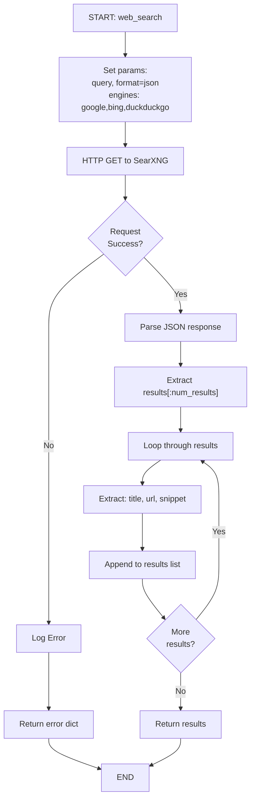

---

## 2. format_results(results)

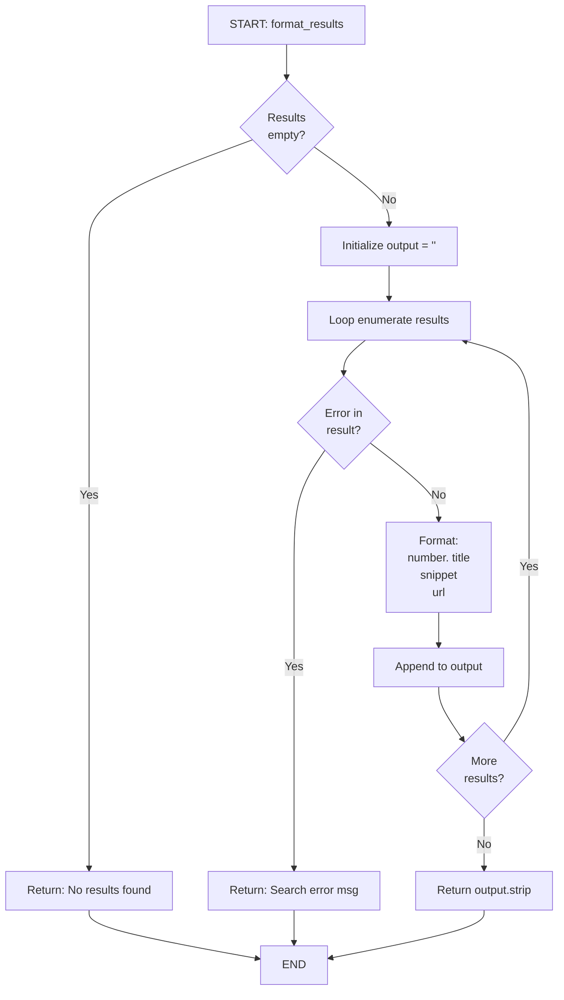

---

## 3. speak(text)

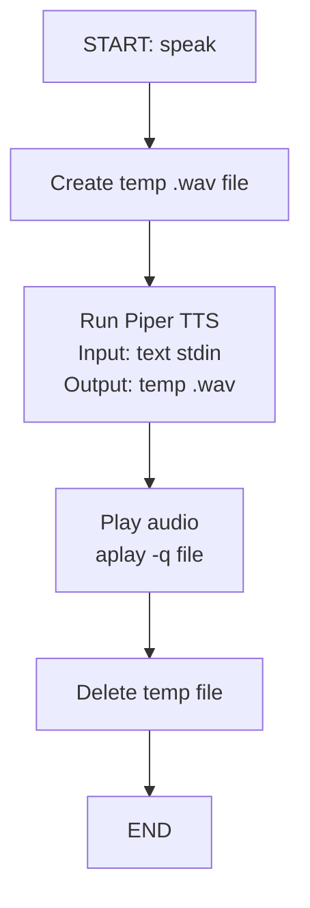

---

## 4. _get_whisper()

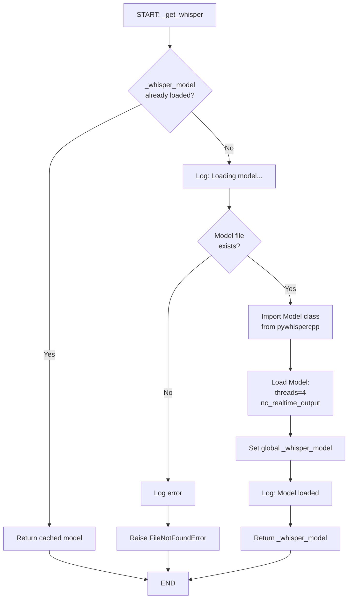

---

## 5. listen()

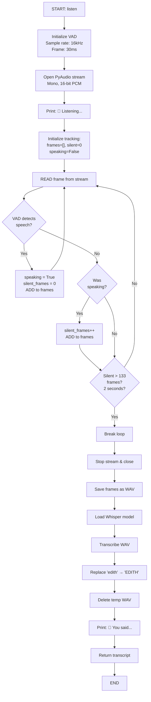

---

## 6. cleanup()

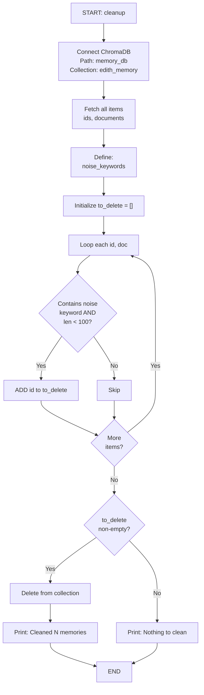

---

## 7. send_telegram(message, parse_mode)

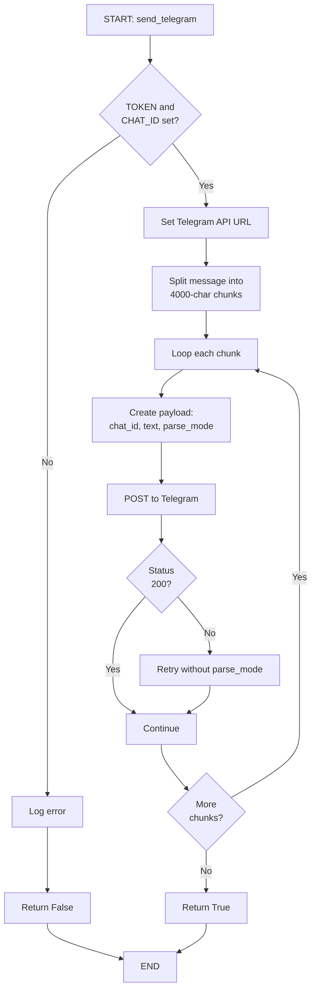

---

## 8. process_message(text)

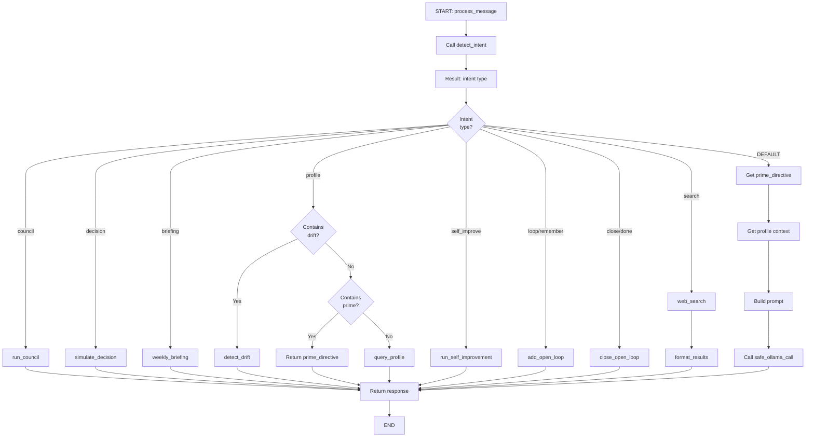

---

## 9. poll_telegram()

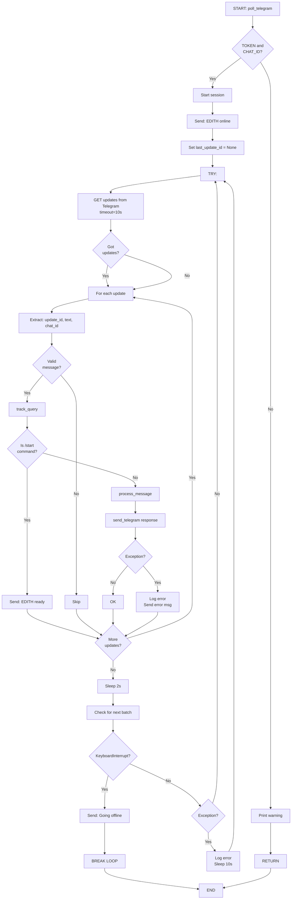

---

## 10. send_weekly_briefing()

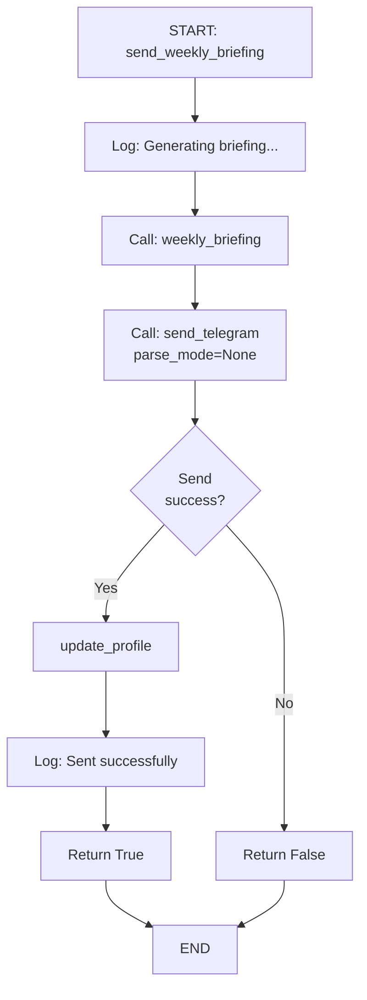

---

## 11. send_drift_alert()

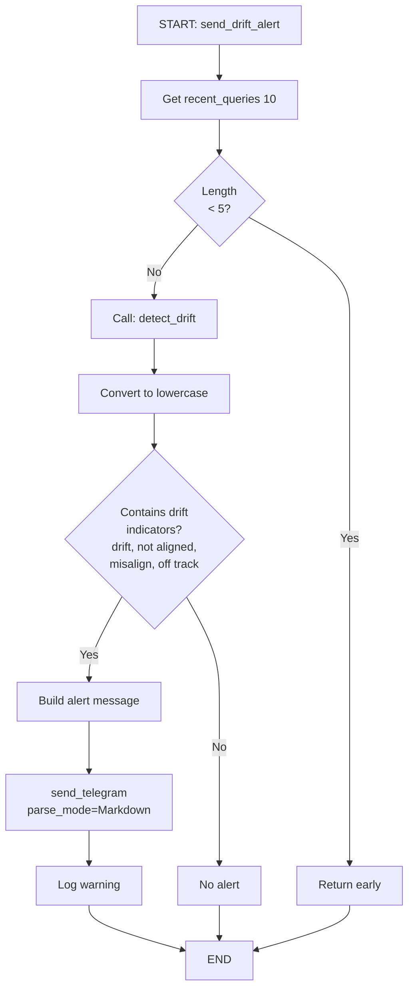

---

## 12. start_briefing_scheduler()

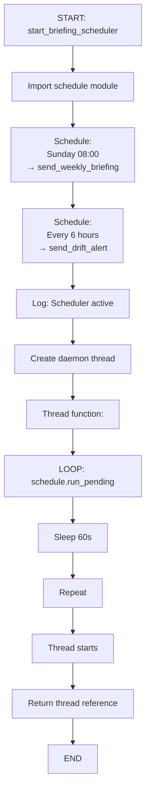

---

## System Data Flow

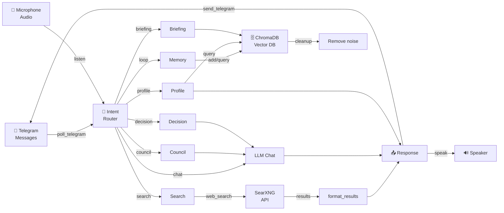

---

## Scheduler Flow

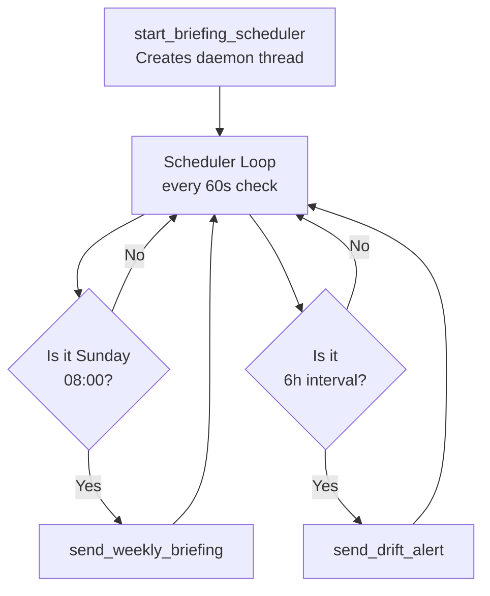
